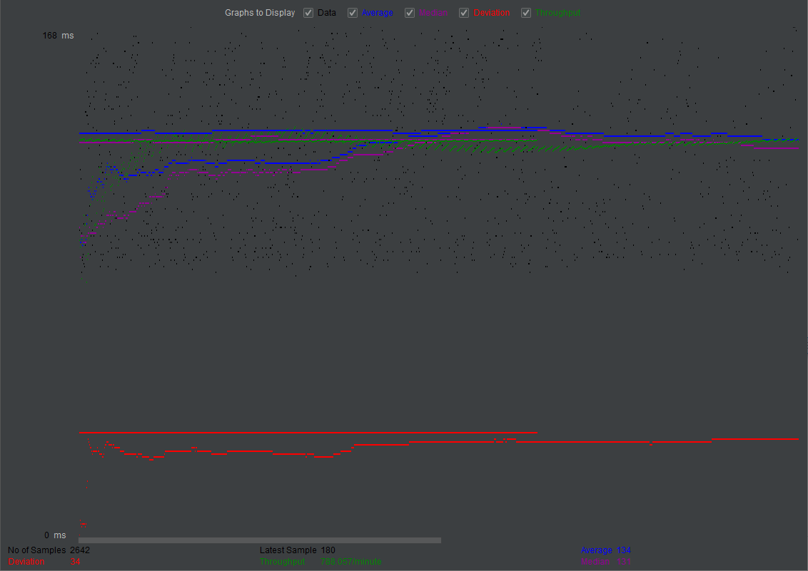
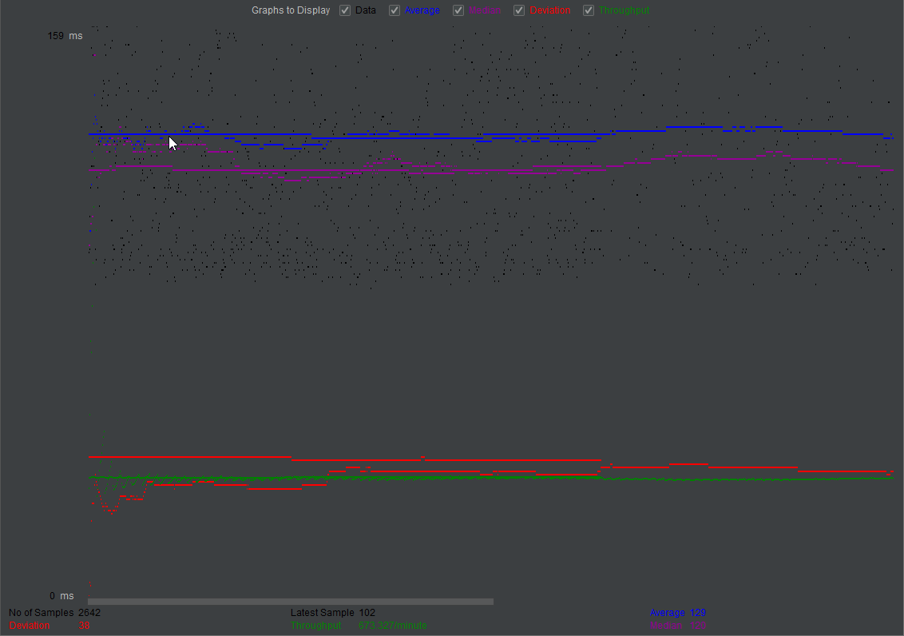

- # General
    - #### Team#: 99
    
    - #### Names:
            Garfield Tsui
    
            Nathaniel Louis Crisostomo Tisuela
    
    - #### Project 5 Video Demo Link: https://www.youtube.com/watch?v=2PgFoPZQS-s

    - #### Instruction of deployment:
    If you have not done so, populate your 'moviedb' database with the movie-data.sql file.
    
    If on development machine, simply run the program on intellij with the Tomcat Configuartion.
    
    If on production machine, use mvn package command where the pom.xml file is located to compile the java code. Move the .war file to the the tomcat/webapps directory.
    
    Run the password encryption script UpdateSecurePassword. In order to do so, you need to set iWantToEncrypt to true as well as database to either customers or employees depending on the database you wish to encrypt.
    
    No technologies were used beyond the ones supported by the class (CSS, JS, Java, HTML)

    - #### Collaborations and Work Distribution:
            Nathantiel:
                Connection pooling
                MySql Routing
            
            Garfield:
                Jmeter tests
                log_processing.py
                
            Group effort:
                Master-slave replication
                Load balancing configuration

- # Connection Pooling
    - #### Include the filename/path of all code/configuration files in GitHub of using JDBC Connection Pooling.
            
            Resources defined in:
            			Web/WebContent/META-INF/context.xml
            
            		All connection (pooling and no pooling) are made in:
            			Web/src/utilites/MyUtils.java
            
            		Files that use pooling:
            			Web/src/*Servlet.java			(all servlets use pooling -- all servlets make a query)
            			Web/src/VerifyPassword.java		(Web/src/LoginServlet.java calls this)
            			
    - #### Explain how Connection Pooling is utilized in the Fabflix code.
            
            Every connection is created using static methods defined in Web/src/utilites/MyUtils.java. 
            For reads, we call MyUtils.getReadConnection(), which makes a connection using the moviedb_read resource.
            For writes, we call MyUtils.getWriteConnection(), which makes a connetion using the moviedb_write resource.
            Both methods create an Environment Context to make a DataSource, from which a connection is retrieved and returned.
            We close each connection the same as the past in order to free up that connection again (not physically closed) 
    - #### Explain how Connection Pooling works with two backend SQL.
    
            All reads are created with a connection pool from the local MYSQL
            All writes are created with a connection pool from the master MYSQL 
    

- # Master/Slave
    - #### Include the filename/path of all code/configuration files in GitHub of routing queries to Master/Slave SQL.
    
            Files for routing:
            		Read and Write resources defined in:
            			Web/WebContent/META-INF/context.xml
            				Write is moviedb_write
            				Read is moviedb_read
            
            		All connections made in:
            			Web/src/utilites/MyUtils.java
            				Reads called by MyUtils.getReadConnection() using resource moviedb_read
            				Writes called by MyUtils.getWriteConnection() using resource moviedb_write

    - #### How read/write requests were routed to Master/Slave SQL?
            We define two resources for MYSQL Database connections in context.xml:
            			moviedb_read:
            				Connection via localhost user mytestuser. It connects to the backend MYSQL on the instance which uses this resource
            
            			moviedb_write
            				Connection via master-instance user fabflix-master. Regardless of what instance uses this resource, it will connect to the master instance's backend MYSQL. This way all writes are propogated thoroughly, and no writes are made in any instance except the master instance

- # JMeter TS/TJ Time Logs
    - #### Instructions of how to use the `log_processing.*` script to process the JMeter logs.
    
            The log_processing.py script found at the root of our project is used as a command line script.
            eg python log_processing.py <pathtofile>
            The file it processes is a csv file where the first column of each entry is for TS values 
            and the second column of each entry is for TJ values.

- # JMeter TS/TJ Time Measurement Report

| **Single-instance Version Test Plan**          | **Graph Results Screenshot** | **Average Query Time(ms)** | **Average Search Servlet Time(ms)** | **Average JDBC Time(ms)** |
|------------------------------------------------|------------------------------|----------------------------|-------------------------------------|---------------------------|
| Case 1: HTTP/1 thread                          |         | 95|10.59| 8.76|
| Case 2: HTTP/10 threads                        |  |134|49.47|41.46|
| Case 3: HTTPS/10 threads                       | |129|41.80|34.88|
| Case 4: HTTP/10 threads/No connection pooling  |         |172|85.99|76.79|

| **Scaled Version Test Plan**                   | **Graph Results Screenshot** | **Average Query Time(ms)** | **Average Search Servlet Time(ms)** | **Average JDBC Time(ms)** |
|------------------------------------------------|------------------------------|----------------------------|-------------------------------------|---------------------------|
| Case 1: HTTP/1 thread                          |  | 96|Master:  9.94 Slave: 10.33 Average: 10.135|Master:  8.50 Slave:  8.61 Average:  8.555|
| Case 2: HTTP/10 threads                        | |109|Master: 20.87 Slave: 22.26 Average: 21.565|Master: 16.52 Slave: 17.26 Average: 16.890|
| Case 3: HTTP/10 threads/No connection pooling  |  |142|Master: 76.74 Slave: 20.85 Average: 48.795|Master: 68.65 Slave: 18.02 Average: 43.335|

- # Jmeter TS/TJ Time measurement analysis
        From the table above, we can see that while under load (10 threads), having a scaled 
        instance greatly inproves the response time. There was not much of a difference between
        the single instance and scaled instances when fulfilling the request of just 1 user (1 thread)
        because the servlet would never have a large buffer of requests.
        We can also see connection pooling greatly improving the response time as well.
        
        As for the disparity between Average Query Time and Average Search Time + Average JDBC Time,
        this is due to Query Time also accounting for delays due to the network (eg sending the
        request over the internet and then waiting for the response from the webserver.)
        
        There is also a disparity between the case of the scaled instance with no connection pooling.
        The master instance reported a much higher response time than the slave instance. This is probably
        due to the load balancer not properly splitting up requests. This is also reflected in the difference
        in the size of the log files between the two.

